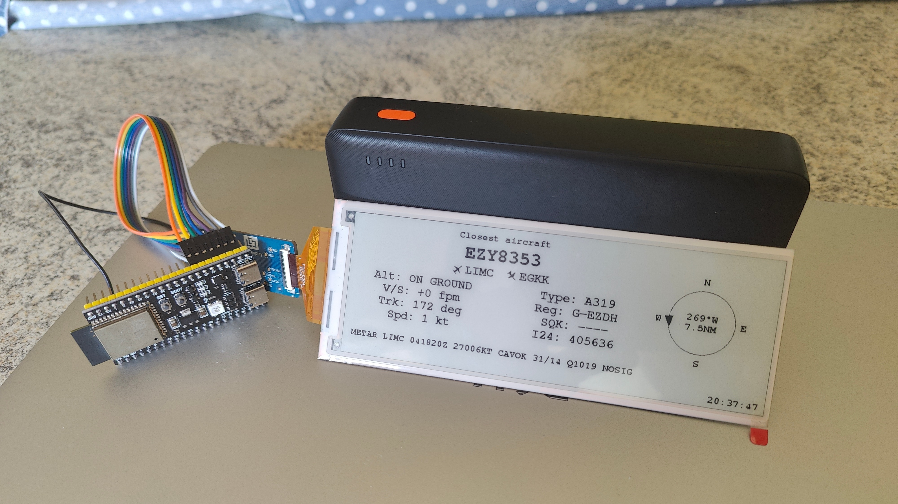

# ESP32-S3 Plane Tracker

A little desk gadget that watches the sky above you. Running on an ESP32-S3, it polls live flight-tracking APIs, works out which aircraft is currently closest to a location you set, and shows the details on an e-paper display.




## Features

- Finds the closest aircraft to a fixed latitude/longitude using the [OpenSky Network](https://opensky-network.org/) API
- Enriches the result with route and aircraft type data from the [FlightAware AeroAPI](https://www.flightaware.com/commercial/aeroapi)
- Renders to a black-and-white e-paper display via [GxEPD2](https://github.com/ZinggJM/GxEPD2)
- Shows, per aircraft:
  - Callsign
  - Altitude
  - Ground speed
  - Distance from your location
  - Bearing relative to your position
  - Departure and arrival airports
  - Squawk code
  - ICAO 24-bit hex identifier

## Hardware

| Component | Notes |
|---|---|
| ESP32-S3 dev board | ESP32-S3-WROOM-1/1U/2 |
| E-paper display | Any panel supported by `GxEPD2_BW` — mine is the `GDEY0579T93` |
| Enclosure | 3D-printable case, files to be added to `/enclosure` once designed |

## How it works

1. The ESP32-S3 connects to Wi-Fi.
2. It queries the OpenSky Network API for aircraft state vectors within a bounding box around your configured location.
3. It calculates the great-circle distance and bearing from your location to every aircraft returned, and picks the closest one.
4. It queries the FlightAware API for that aircraft's route and type information.
5. It renders all of the collected data to the e-paper display.
6. It sleeps/waits, then repeats.

All credentials are set in `config.h`.

## Getting started

### 1. Prerequisites

- [Arduino IDE](https://www.arduino.cc/en/software) or PlatformIO with ESP32 board support installed
- The [GxEPD2](https://github.com/ZinggJM/GxEPD2) library (and its dependencies, e.g. Adafruit GFX)
- An [OpenSky Network](https://opensky-network.org/) account (free tier is fine for personal use)
- A [FlightAware AeroAPI](https://www.flightaware.com/commercial/aeroapi/) key (also free since calls remain in the 5$ free credit quota)

### 2. Configure

Copy the example config and fill in your own details:

```bash
cp config.example.h config.h
```

Edit `config.h`:

```cpp
// --- Wi-Fi ---
const char* WIFI_SSID     = "your-wifi-ssd";
const char* WIFI_PASSWORD = "your-wifi-password";

// --- OpenSky API ---
const char* OPENSKY_CLIENT_ID     = "your-opensky-client-id";
const char* OPENSKY_CLIENT_SECRET = "your-opensky-client-secret";
const char* OPENSKY_TOKEN_URL = "https://auth.opensky-network.org/auth/realms/opensky-network/protocol/openid-connect/token";
const char* OPENSKY_API_HOST  = "opensky-network.org";

// --- FlightAware AeroAPI (type / registration / route lookup) ---
const char* FLIGHTAWARE_API_HOST = "aeroapi.flightaware.com";
const char* FLIGHTAWARE_API_KEY  = "your-opensky-api-key";

// --- Location / search box ---
const float HOME_LAT       =  40.1098f;
const float HOME_LON       = -88.2170f;
const float SEARCH_BOX_DEG = 0.50f; // half-width of the bounding box (~30 nm)

// --- Timing ---
const unsigned long POLL_INTERVAL_MS = 30000UL; // polling rate
const int           FULL_REFRESH_EVERY = 10;    // full e-paper refresh every N partials

// --- Time / NTP ---
const char* NTP_TIMEZONE = "CET-1CEST,M3.5.0/2,M10.5.0/3"; // Europe/Rome, CET/CEST DST
const char* NTP_SERVER_1 = "pool.ntp.org";
const char* NTP_SERVER_2 = "time.google.com";

// --- METAR ---
// ICAO code of the airport whose METAR is displayed in the bottom bar.
const char* METAR_AIRPORT = "LIMC";
```

`config.h` is included in `.gitignore` so your credentials and location never get committed.

### 3. Flash it

Open the project in the Arduino IDE (or PlatformIO), select your ESP32-S3 board, and upload.

## Roadmap / TODO

- [ ] Design and publish the 3D-printed enclosure (`/enclosure`)

## Repository structure

```
.
├── src/
│   ├── config.example.h  # template for config.h (copy and fill in your own)
│   └── ...               # firmware source
├── enclosure/            # 3D-printable enclosure files (coming soon)
└── README.md
```

## Credits / data sources

- Flight data: [OpenSky Network](https://opensky-network.org/)
- Route and aircraft type data: [FlightAware AeroAPI](https://www.flightaware.com/commercial/aeroapi/)
- Display driver: [GxEPD2](https://github.com/ZinggJM/GxEPD2) by ZinggJM

Please review the terms of use of the OpenSky Network and FlightAware AeroAPI before deploying this for anything beyond personal, non-commercial use.

## License

This project is licensed under the **GNU General Public License v3.0**. See [LICENSE](LICENSE) for the full text.
